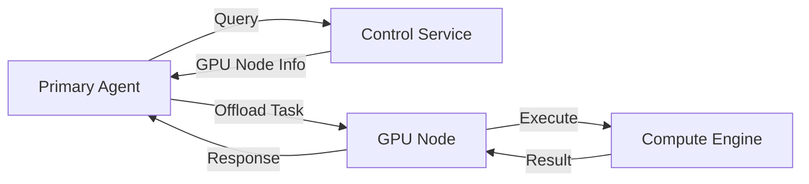

<div align="center">

# Zero Compute

<p>
  <b>Automatic Mesh-Based Compute Sharing System</b><br/>
  Seamlessly offload heavy workloads across machines — without changing your code.
</p>

<p>
  
  
  
  
</p>

</div>

---

## Overview

Zero Compute is a lightweight distributed system that automatically offloads compute-intensive workloads from your primary machine to more powerful devices on the same network.

It eliminates the need for manual orchestration by introducing an intelligent auto-offload layer.

> Write normal code. Run it anywhere.

---

## Core Idea

```text
Local Machine → Detect Heavy Task → Route to GPU Node → Execute → Return Result
```

The execution location becomes invisible to the developer.

---

## Architecture



---

## System Components

<table>
<tr>
<th align="left">Component</th>
<th align="left">Description</th>
</tr>

<tr>
<td><b>Primary Agent</b></td>
<td>Decision layer that evaluates tasks and routes them intelligently</td>
</tr>

<tr>
<td><b>GPU Node</b></td>
<td>Worker machine that executes compute-heavy workloads</td>
</tr>

<tr>
<td><b>Control Service</b></td>
<td>Registry that tracks available nodes and enables discovery</td>
</tr>

</table>

---

## Features

* Automatic workload offloading
* Zero modification to user code
* LAN-based distributed execution
* Modular and extensible architecture
* Intelligent fallback to local execution
* Designed for AI and compute-heavy workflows

---

## Project Structure

```text
zero-compute/
│
├── control-service/
├── gpu-node/
├── primary-agent/
├── shared/
└── docs/
```

---

## Getting Started

### Requirements

* Two machines on the same network
* Python 3.10+
* Basic networking knowledge

---

### Setup Flow

1. Start Control Service
2. Start GPU Node
3. Register node
4. Run Primary Agent
5. Execute task

---

## MVP Scope

* Single GPU node
* LAN-based execution
* One task category (AI / simulated workload)
* Basic decision heuristics

---

## Future Roadmap

* Multi-node scheduling
* Load balancing
* Dockerized execution
* Secure communication
* Mesh networking
* Smart resource monitoring

---

## Design Philosophy

> Compute should not depend on where it runs.

Zero Compute abstracts execution into a distributed layer, allowing developers to focus purely on logic.

---

## Contributing

Contributions are welcome.
Focus on system design, performance optimization, and distributed scheduling.

---

## License

MIT License

---

<div align="center">

### Built for developers who think beyond a single machine

</div>
