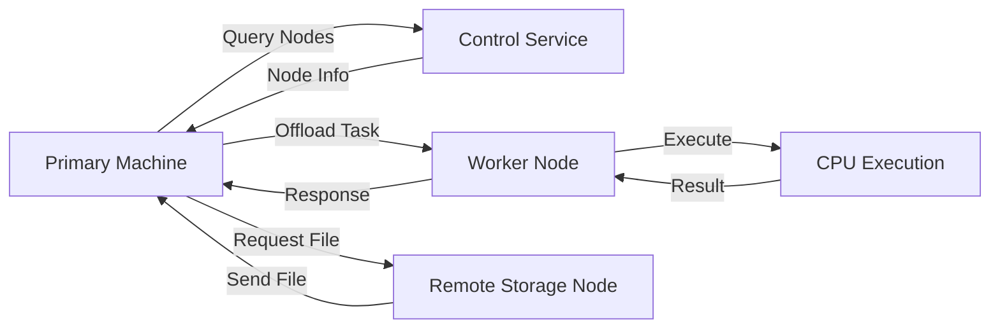

<div align="center">

# Zero Compute

<p>
  <b>Intelligent Distributed Compute + Storage System</b><br/>
  Automatically share computing power and storage across machines — with zero manual effort.
</p>

<p>
  
  
  
  
</p>

</div>

---

## Overview

Zero Compute is a lightweight distributed system that transforms multiple machines into a **single intelligent computing environment**.

It not only shares compute power across devices but also manages storage dynamically — automatically moving, syncing, and retrieving data based on usage patterns.

> Your system behaves like one machine — regardless of where the data or compute lives.

---

## Core Idea

```text id="w6t9v9"
Access File / Run Task
        ↓
System decides:
- Run locally?
- Offload compute?
- Fetch file from another machine?
        ↓
Execute → Return result transparently
```

---

## What Makes It Different

Unlike traditional systems:

* No manual file transfer
* No manual compute distribution
* No explicit remote execution calls

Zero Compute introduces **intelligence** into both compute and storage layers.

---

## Key Capabilities

### 1. Compute Sharing

* Automatically offloads heavy tasks to other machines
* Uses available CPU resources across the network
* Falls back to local execution if needed

---

### 2. Intelligent Storage Management

* Automatically shifts rarely used files to other machines
* Keeps frequently accessed files local
* Pulls files back instantly when needed

---

### 3. Transparent Execution

* Users interact with files and programs normally
* System handles location, transfer, and execution internally

---

## Architecture



---

## System Components

<table>
<tr>
<th align="left">Component</th>
<th align="left">Description</th>
</tr>

<tr>
<td><b>Primary Agent</b></td>
<td>Controls task execution and file access decisions</td>
</tr>

<tr>
<td><b>Worker Node</b></td>
<td>Executes compute tasks from other machines</td>
</tr>

<tr>
<td><b>Storage Node</b></td>
<td>Stores files and serves them on demand</td>
</tr>

<tr>
<td><b>Control Service</b></td>
<td>Tracks nodes and manages discovery</td>
</tr>

</table>

---

## How It Works

1. User opens a file or runs a task
2. System checks:

   * Where is the file?
   * Is the task heavy?
3. If file is remote → it is fetched automatically
4. If task is heavy → it is offloaded
5. Execution happens
6. Result is returned seamlessly

---

## Intelligent Behavior (Core Innovation)

* Frequently used files → stay local
* Rarely used files → moved to other machines
* Large tasks → distributed automatically
* System adapts based on usage patterns

---

## Project Structure

```text id="w3xgpf"
zero-compute/
│
├── control-service/     # Node registry
├── worker-node/         # Compute execution
├── storage-node/        # File storage + transfer
├── primary-agent/       # Decision engine
├── shared/              # Configs & schemas
└── docs/                # Documentation
```

---

## MVP Scope

* CPU-based compute sharing
* Basic file transfer between machines
* Simple usage-based file movement
* Single worker and storage node

⚠️ GPU support and advanced intelligence are planned.

---

## Future Roadmap

* GPU-based compute sharing
* Smart caching algorithms
* Predictive file placement
* Multi-node scheduling
* Distributed file system layer
* Cross-network support

---

## Use Cases

* Extend laptop performance using other machines
* Share storage across personal devices
* Run heavy tasks without upgrading hardware
* Build a personal distributed system

---

## Design Philosophy

> Compute and storage should not be tied to a single machine.

Zero Compute creates a system where resources are shared, adaptive, and invisible to the user.

---

## Contributing

Contributions are welcome. Focus areas include scheduling, storage strategies, and distributed coordination.

---

## License

MIT License

---

<div align="center">

### One system. Many machines. Zero boundaries.

</div>
