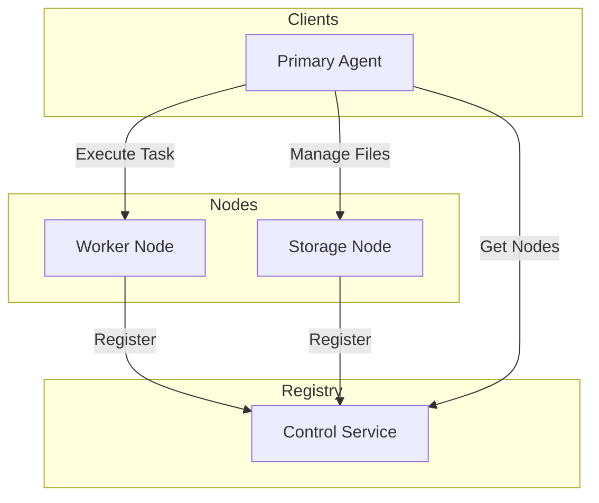

# ZeroCompute Architecture Documentation

ZeroCompute is a distributed computing platform that separates responsibilities into specialized, interconnected services. This document outlines the system architecture and the role of each component.

## System Architecture

The following diagram illustrates the interactions between the different services in the ZeroCompute ecosystem.

## Component Breakdown

### 1. Control Service (Registry)
The Control Service acts as the central directory for the entire system. It maintains a real-time list of all active worker and storage nodes.
- **Node Store**: An in-memory database of active nodes and their metadata.
- **Registry Logic**: Handles node registration and provides filtering capabilities to find nodes by role.
- **API**: Provides endpoints for nodes to announce their presence and for clients to discover available resources.

### 2. Worker Node (Compute)
Worker Nodes are responsible for executing intensive computational tasks.
- **Registration**: On startup, the node automatically registers with the Control Service.
- **Task Handler**: Contains the core logic for data processing and task execution.
- **Executor**: Manages the lifecycle of a task from receiving the request to returning the result.

### 3. Storage Node (Persistence)
The Storage Node provides a networked interface for file management, abstracting the underlying file system.
- **File Manager**: Handles reading from and writing to the local storage directory.
- **API**: Provides standardized endpoints for file uploads, downloads, and directory listing.

### 4. Primary Agent (Orchestrator)
The Primary Agent is the intelligent interface through which users or other systems interact with ZeroCompute.
- **Decision Engine**: Analyzes incoming tasks to determine if they should be handled locally or offloaded to a Worker Node based on complexity.
- **Orchestrator**: Coordinates the interaction between the Registry, Compute nodes, and Storage nodes to fulfill requests.
- **Service Clients**: Helper modules that standardize communication with other microservices.

## Shared Layer
The shared layer contains common data structures and schemas used across all services to ensure consistency and type safety during communication.

## Operational Flow
1. **Node Startup**: Worker and Storage nodes start and register their IP/Port with the Control Service.
2. **Task Reception**: The Primary Agent receives a task.
3. **Task Analysis**: The Decision Engine evaluates the task complexity.
4. **Discovery**: For complex tasks, the Agent queries the Control Service for an available Worker.
5. **Execution**: The Agent offloads the task to the selected Worker and returns the result to the user.
